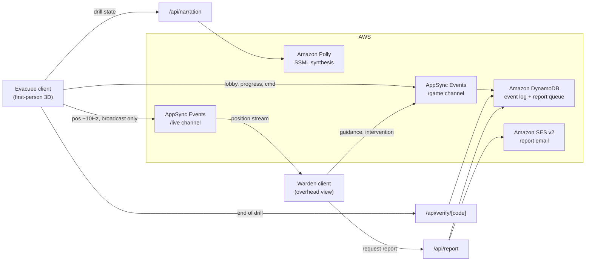

# CampusEvac

A two-player, real-time fire evacuation simulation that runs entirely in the browser.

GitHub: https://github.com/AfreenInnovates/campus 
Demo video: https://youtu.be/FhgTfCz0ou8 
Try it: https://main.d3skpx6qxc85hh.amplifyapp.com/

### The problem

Real fire drills are expensive, disruptive, and impossible to run often enough to build actual muscle memory. Traditional fire-safety training is passive - posters, one-off drills, a fire marshal reading a checklist - and it never rehearses the part that actually matters in an emergency: two people, in different positions, making decisions together under time pressure. Most drills only train the person evacuating. Almost none train the person coordinating the response.

### What it does

CampusEvac splits a single evacuation drill across two players who depend on each other to succeed.

* The **evacuee** walks through a smoke-filled campus building in first person, working through objectives to reach the outdoor assembly point before conditions get worse.
* The **warden** watches the same building from an overhead view, verifies the evacuee's progress, sends route guidance, and can trigger a ventilation intervention when smoke blocks the way.

Neither role can finish the drill alone. Every position update, command, and lobby event is synced live between the two players, and the full session history is recorded so a run can be replayed and sanity-checked afterward.

### Who it's for

Schools, colleges, universities, and offices that want a low-cost, repeatable, gamified way to build evacuation awareness - without pulling the whole building out onto the lawn every time. It's built specifically to also train the warden or safety-officer role, which almost no existing drill format covers.

### How it works

A drill runs as a lobby with two connected clients. Position and movement data streams on a high-frequency channel that is broadcast-only and never stored. Lobby actions, pings, interventions, and the final outcome go through a second channel and are persisted, so every command a warden issued and every objective an evacuee completed is on record. At the end of a run, that record is replayed against the drill's authored order and timing to catch runs that couldn't have physically happened - advisory only, it never blocks or changes a result.

Narration for the warden is composed from the live drill state and spoken back with synthesized voice, with common lines cached so repeat situations don't need to be re-synthesized. Players can request an emailed performance report at the end of a drill, scored from the same measurements the report route recomputes independently rather than trusting whatever the client sends.

### Tech stack

* Next.js (App Router, SSR) with React and TypeScript
* React Three Fiber, drei, and Rapier for the first-person 3D environment and physics
* Zustand for simulation state
* AWS AppSync Events for the realtime channel layer
* Amazon DynamoDB for the event log and report queue
* Amazon Polly for narration synthesis
* Amazon SES v2 for emailed reports
* AWS CDK for infrastructure, AWS Amplify Hosting for continuous deployment

### Architecture

### Impact

CampusEvac turns evacuation training from a once-a-semester disruption into something a school or office can run repeatedly, at no marginal cost, without evacuating the actual building. It's the first drill format we've seen that treats the evacuee and the warden as one problem instead of two, which is the part real drills consistently skip and the part that decides how an actual emergency goes.

### Status

Built for AWS First Commit. The core loop - lobby, sync, drill, verification, report - is fully working end to end.
